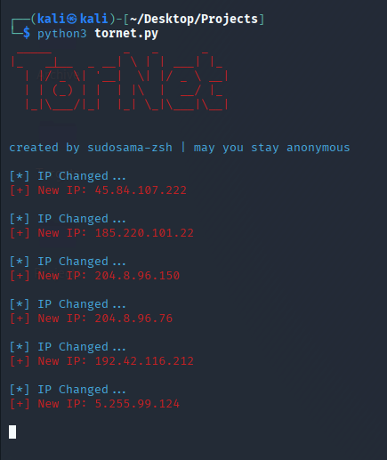

# TorNet
Become a ghost — New IP every 60 seconds.

## 🔧 Installation & Setup

### 1. Install Tor and ProxyChains

```bash
sudo apt update
sudo apt install tor proxychains
```
2. Generate a Tor control password hash

```bash
tor --hash-password your_password_here
```
Type your password, and it will be converted into a hashed password.

### 3. Edit your torrc configuration
```bash
sudo nano /etc/tor/torrc
```
Scroll to the bottom of the file and add the following lines:
```yaml

ControlPort 9051
HashedControlPassword your_hashed_password_here
CookieAuthentication 1
```
Replace your_hashed_password_here with the hash generated in the previous step.

### 4. Edit proxychains configuration (optional)
```bash
sudo nano /etc/proxychains.conf
```
At the bottom of the file, add: 
```yaml
socks5 127.0.0.1 9050
```
If there is a line like this: 
```yaml
socks4 127.0.0.1 9050
```
Comment it out by adding a # at the beginning: 
```yaml
#socks4 127.0.0.1 9050
```
### 5. Add your password to the Python script
Open the Python script (tornet.py) and on line 40, replace the password:
```yaml
controller.authenticate(password='your_original_password')  # <-- your original (non-hashed) password
```
### 6. Restart Tor and Run the Script
```bash
sudo systemctl restart tor
python3 tornet.py
```
You should see the banner and your new Tor IP.

If you reboot your system, remember to start the Tor service again: 
```bash
sudo systemctl start tor
```
To stop it manually: 
```bash
sudo systemctl stop tor
```
